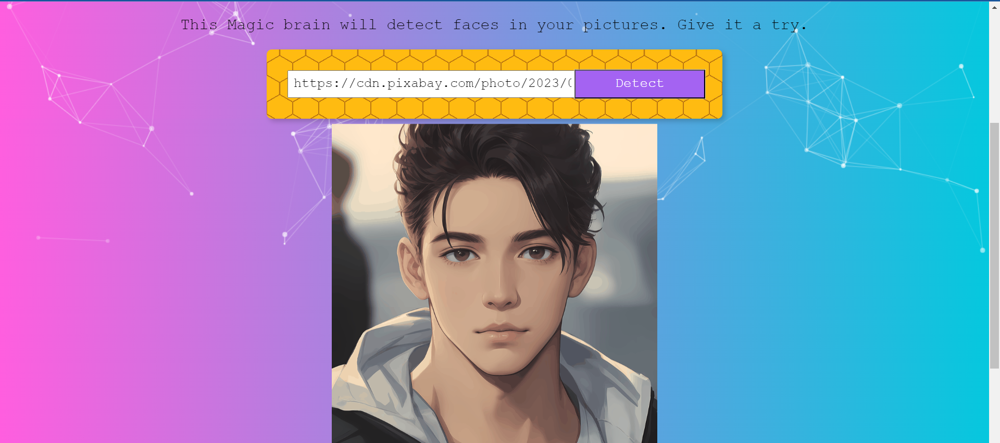

# Face Recognition Brain



## Table of Contents

- [Introduction](#introduction)
- [Tech Stack](#tech-stack)
- [Features](#features)
- [Getting Started](#getting-started)
  - [Prerequisites](#prerequisites)
  - [Installation](#installation)
- [Usage](#usage)
- [Contributing](#contributing)
- [License](#license)
- [Acknowledgments](#acknowledgments)

## Introduction

Face Recognition brain utilizes Clarifai api model to detect faces in images! This application allows users to log in, upload an image from a URL, and detects faces in the image using the Clarifai API's face detection model. The detected faces are highlighted, providing a user-friendly interface for face recognition.

## Tech Stack

- Frontend: React
- Backend: Express 
- Database Management System (DBMS): PostgreSQL
- Machine Learning Model API: Clarifai API Face Detection Model

## Features

- User authentication with login and logout functionality.
- Image input from a URL
- Face detection using the Clarifai API.
- Highlighting of detected faces in the uploaded image.


## Getting Started

### Prerequisites

- Node.js and npm (Node Package Manager) installed on your system.
- A code editor such as Visual Studio Code.

### Installation

1. Clone the repository:

   ```sh
   git clone https://github.com/hanzala-bhutto/React-Express-FaceRecognitionBrain
   
2. Navigate to the project directory:

    ```sh
    cd React-Express-FaceRecognitionBrain

3.  Install all dependencies:

    ```sh
    install

4. Run project:

    ```sh
    npm run backend
    npm run frontend

